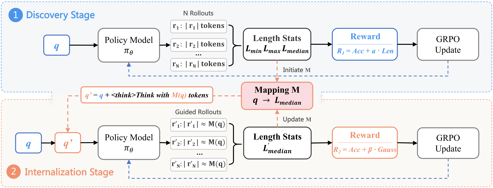

<div align="center">


<h1 style="display: flex; justify-content: center; align-items: center; gap: 10px; margin: 0;">
LAPO: Internalizing Reasoning Efficiency via Length-Adaptive Policy Optimization
</h1>
<p align="center"><em></em></p>

<p><em>A two-stage RL framework that teaches models to internalize reasoning efficiency.</em></p>

[](http://arxiv.org/abs/2507.15758) [](https://www.alphaxiv.org/abs/2507.15758) [](https://github.com/zju-real/LAPO)

</div>

<br>

<div align="center">
  
  <p><em>LAPO's two-stage framework: first discover natural reasoning lengths, then internalize them as self-proposed budgets.</em></p>
</div>

---

## 🎉 News
*   **[2025-7-22]** Our paper, **LAPO: Internalizing Reasoning Efficiency via Length-Adaptive Policy Optimization**, is now available on arXiv!
*   **[Coming Soon]** We plan to release the LAPO-trained models and training configurations. Stay tuned!

---

## Table of Contents
* [Motivation](#motivation)
* [Highlights](#-highlights)
* [Installation](#-installation)
* [Training Pipeline](#-training-pipeline)
* [Results](#-results)
* [Citation](#-citation)
* [Acknowledgement](#-acknowledgement)

---

## Motivation
Large reasoning models often "overthink," generating excessively long and computationally expensive reasoning chains even for simple problems. Existing methods try to fix this with external, rigid constraints, which can harm accuracy and lack adaptability.

<div align="center">
  
  <p><em>Without LAPO, models are verbose. With LAPO, they learn to be concise and efficient.</em></p>
</div>

LAPO is built on a new paradigm: what if models could learn the appropriate reasoning depth themselves? Our key insight is that the lengths of successful solutions contain valuable signals about a problem's intrinsic complexity. LAPO is designed to:

1.  **Discover** these natural reasoning patterns through a length-aware reward mechanism.
2.  **Internalize** these patterns by framing them as self-proposed plans within the model's own thought process, leading to genuine, adaptive efficiency.

---

## ✨ Highlights

*   💡 **Intrinsic Length Control**: Transforms length control from an external command into an internalized skill. The model learns *when* to think more and *when* to be concise.
*   🚀 **Simultaneous Efficiency & Accuracy Gains**: Reduces token usage by up to **40.9%** while simultaneously improving accuracy by **2.3%** on challenging math benchmarks.
*   ⚙️ **Two-Stage RL Framework**: A robust pipeline that first discovers optimal reasoning lengths (Discovery Stage) and then teaches the model to proactively plan for them (Internalization Stage).
*   📊 **State-of-the-Art Efficiency Frontier**: Outperforms existing methods by achieving a superior balance between accuracy and computational cost.

---

## 🛠 Installation

Our framework is built upon **OpenRLHF**.

1.  **Create and activate a conda environment:**
    ```bash
    conda create -n lapo python=3.10
    conda activate lapo
    ```

2.  **Install dependencies:**
    ```bash
    git clone https://github.com/zju-real/LAPO.git
    cd LAPO
    pip install -r requirements.txt
    ```
    Please ensure you have a PyTorch version compatible with your CUDA drivers installed.

---

## 🚀 Training Pipeline

LAPO's training is a two-stage process.

### Stage 1: Discovery

The model learns the statistical distribution of optimal reasoning lengths.

```bash
# Run the Discovery stage training
torchrun --nproc_per_node=4 train_lapo.py \
    --pretrain_model_path /path/to/base_model \
    --dataset /path/to/your_dataset.json \
    --lapo_stage 1 \
    --reward_alpha 0.7 \
    --output_dir ./checkpoints/lapo_stage1
```
This stage outputs a `problem_to_length_mapping.json` file, which is crucial for the next stage.

### Stage 2: Internalization

The model learns to use the discovered lengths as self-proposed plans.

```bash
# Run the Internalization stage training
torchrun --nproc_per_node=4 train_lapo.py \
    --pretrain_model_path ./checkpoints/lapo_stage1 \
    --dataset /path/to/your_dataset.json \
    --lapo_stage 2 \
    --reward_beta 0.8 \
    --length_mapping_path ./checkpoints/lapo_stage1/problem_to_length_mapping.json \
    --output_dir ./checkpoints/lapo_stage2
```

---

## 📊 Results

LAPO-trained models consistently achieve higher accuracy with significantly fewer tokens compared to baselines and other efficient reasoning methods.

| **Model** | **MATH-500** | **AIME2024** | **AMC-23** | **OlympiadBench** | **Avg. Pass@1** | **Avg. #Tok** |
| :--- | :---: | :---: | :---: | :---: | :---: | :---: |
| Base (DeepScaleR) | 85.8% | 35.5% | 74.2% | 54.6% | 62.5% | 6229 |
| ThinkPrune-4k | 86.6% | 35.5% | 76.3% | 55.7% | 63.5% | 4094 |
| L1-Max | 81.9% | 24.9% | 72.7% | 50.5% | 57.5% | 2541 |
| **LAPO-I (Ours)** | **86.3%** | **38.1%** | **78.3%** | **56.3%** | **64.8%** | **3832** |

---

## 🙏 Acknowledgement

Our RL training code is built upon the excellent [OpenRLHF](https://github.com/OpenRLHF/OpenRLHF) framework. We extend our sincere gratitude to their team for open-sourcing their powerful library.

---
## 📄 Citation

If you find LAPO useful in your research, please consider citing our work:

```bibtex
@article{wu2025lapo,
  title={{LAPO: Internalizing Reasoning Efficiency via Length-Adaptive Policy Optimization}},
  author={Wu, Xingyu and Yan, Yuchen and Lyu, Shangke and Wu, Linjuan and Qiu, Yiwen and Shen, Yongliang and Lu, Weiming and Shao, Jian and Xiao, Jun and Zhuang, Yueting},
  journal={arXiv preprint arXiv:2507.15758},
  year={2025}
}
```
